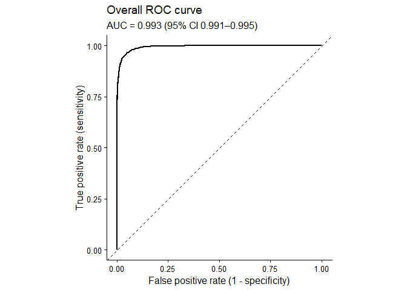
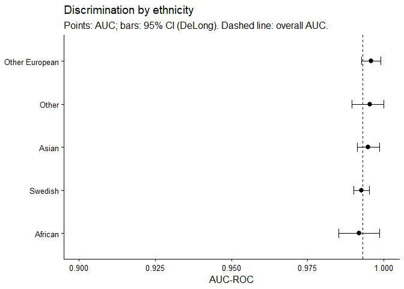
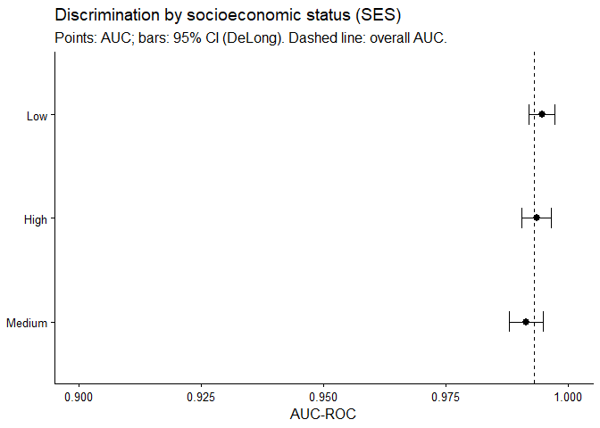
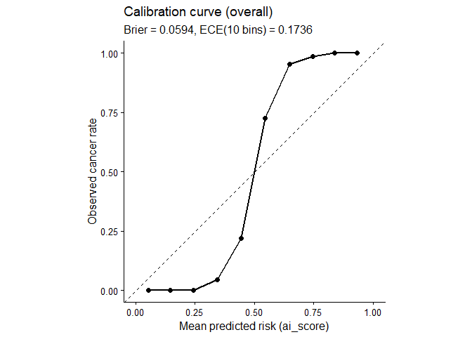
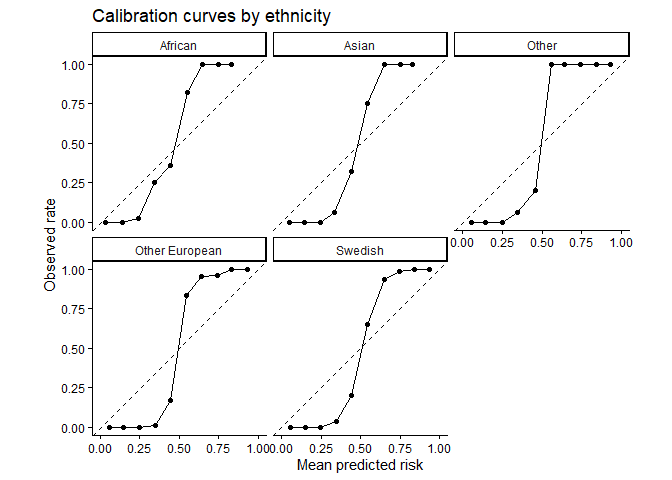
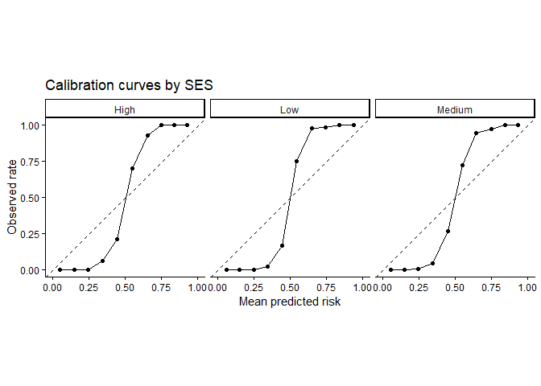
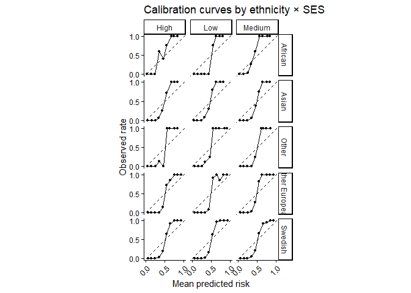
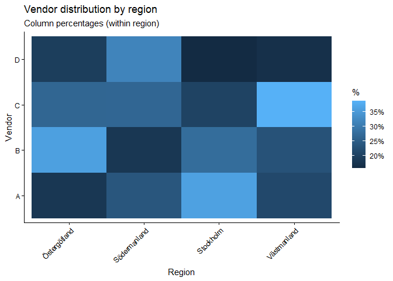
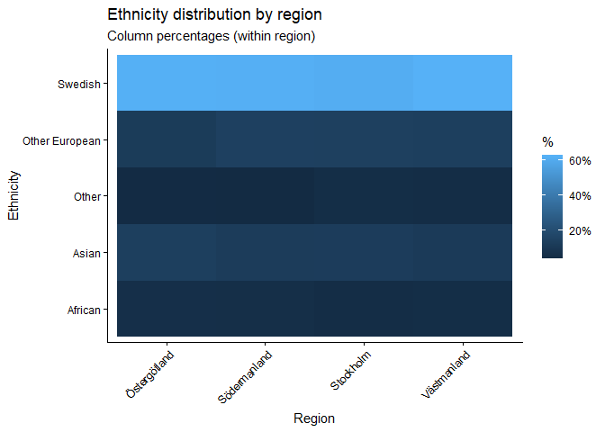

## Background and objectives

### Background

- This project evaluates whether a mammography AI algorithm’s cancer
  detection score performs consistently across demographic subgroups.
  Using a simulated screening dataset (N = 5,000), we quantify:

- Discrimination: how well the AI score separates cancer vs non-cancer
  (AUC-ROC).

- Calibration: whether the score behaves like a probability (predicted
  risk matches observed cancer rates).

- Potential confounding/structure: whether region- and vendor-related
  differences may influence apparent subgroup differences.

- Note: In many real systems, a model output can be a suspicion score
  rather than a calibrated probability. In that case, high AUC can
  coexist with poor calibration.

### Objectives

- Estimate overall and subgroup AUC-ROC (ethnicity, SES, and ethnicity ×
  SES).

- Compare subgroup AUCs to reference groups (Swedish; High SES) using
  DeLong tests.

- Assess overall and subgroup calibration using calibration curves,
  Brier score, and ECE.

- Explore vendor/region structure and examine whether associations
  persist after adjustment (region/vendor/age/density).

## Data & preprocessing

``` r
# Fix: set CRAN mirror so install.packages() works during knitting
options(repos = c(CRAN = "https://cloud.r-project.org"))

pkgs <- c("dplyr","knitr","pROC","ggplot2","scales","broom","tidyr","forcats")

need <- pkgs[!pkgs %in% rownames(installed.packages())]
if(length(need) > 0) install.packages(need)

invisible(lapply(pkgs, library, character.only = TRUE))
```

``` r
data_path <- "C:/Users/22too/OneDrive/Desktop/r_task/mammography_ai_equity_data_simulated.csv"
data_original <- read.csv(data_path, stringsAsFactors = FALSE)

# Type casting + derived intersectional subgroup
data_original <- data_original %>% 
  mutate(
    cancer = as.integer(cancer),
    ethnicity = as.factor(ethnicity),
    ses = as.factor(ses),
    region = as.factor(region),
    vendor = as.factor(mammography_vendor),     # A/B/C/D only
    density = as.factor(breast_density),
    eth_ses = interaction(ethnicity, ses, drop = TRUE, sep = "/")
  ) %>% 
  select(-mammography_vendor, -breast_density)

head(data_original)
```

    ##      exam_id age ethnicity  ses       region cancer ai_score vendor density
    ## 1 EXAM_00000  51     Asian  Low    Stockholm      1   0.6590      A       D
    ## 2 EXAM_00001  55     Asian  Low Södermanland      0   0.1859      C       C
    ## 3 EXAM_00002  44     Other  Low Östergötland      0   0.0885      A       C
    ## 4 EXAM_00003  59   Swedish High    Stockholm      0   0.2578      C       A
    ## 5 EXAM_00004  56   African High    Stockholm      0   0.1046      B       C
    ## 6 EXAM_00005  50   Swedish  Low Östergötland      1   0.7811      B       C
    ##        eth_ses
    ## 1    Asian/Low
    ## 2    Asian/Low
    ## 3    Other/Low
    ## 4 Swedish/High
    ## 5 African/High
    ## 6  Swedish/Low

``` r
miss <- data_original %>% summarise(across(everything(), ~sum(is.na(.))))
kable(miss, caption="Missing values per variable")
```

| exam_id | age | ethnicity | ses | region | cancer | ai_score | vendor | density | eth_ses |
|--------:|----:|----------:|----:|-------:|-------:|---------:|-------:|--------:|--------:|
|       0 |   0 |         0 |   0 |      0 |      0 |        0 |      0 |       0 |       0 |

Missing values per variable

Preprocessing summary

- Cast categorical variables as factors and ensured cancer is 0/1
  integer.

- Created eth_ses (ethnicity × SES) for intersectional summaries.

- Confirmed no missingness in the analytic variables.

### Subgroup sizes

``` r
by_eth <- data_original %>% 
  group_by(ethnicity) %>% 
  summarise(n=n(), cases=sum(cancer), prev=mean(cancer), .groups="drop")

by_ses <- data_original %>% 
  group_by(ses) %>% 
  summarise(n=n(), cases=sum(cancer), prev=mean(cancer), .groups="drop")

by_int <- data_original %>% 
  group_by(eth_ses) %>% 
  summarise(n=n(), cases=sum(cancer), prev=mean(cancer), .groups="drop")

kable(by_eth, digits=3, caption="Group size by ethnicity")
```

| ethnicity      |    n | cases |  prev |
|:---------------|-----:|------:|------:|
| African        |  290 |    57 | 0.197 |
| Asian          |  649 |    93 | 0.143 |
| Other          |  254 |    36 | 0.142 |
| Other European |  699 |   105 | 0.150 |
| Swedish        | 3108 |   447 | 0.144 |

Group size by ethnicity

``` r
kable(by_ses, digits=3, caption="Group size by SES")
```

| ses    |    n | cases |  prev |
|:-------|-----:|------:|------:|
| High   | 1557 |   192 | 0.123 |
| Low    | 1427 |   235 | 0.165 |
| Medium | 2016 |   311 | 0.154 |

Group size by SES

``` r
kable(by_int, digits=3, caption="Group size by ethnicity × SES")
```

| eth_ses               |    n | cases |  prev |
|:----------------------|-----:|------:|------:|
| African/High          |   96 |    19 | 0.198 |
| Asian/High            |  197 |    20 | 0.102 |
| Other/High            |   79 |    12 | 0.152 |
| Other European/High   |  231 |    29 | 0.126 |
| Swedish/High          |  954 |   112 | 0.117 |
| African/Low           |   74 |    13 | 0.176 |
| Asian/Low             |  189 |    32 | 0.169 |
| Other/Low             |   69 |    14 | 0.203 |
| Other European/Low    |  202 |    35 | 0.173 |
| Swedish/Low           |  893 |   141 | 0.158 |
| African/Medium        |  120 |    25 | 0.208 |
| Asian/Medium          |  263 |    41 | 0.156 |
| Other/Medium          |  106 |    10 | 0.094 |
| Other European/Medium |  266 |    41 | 0.154 |
| Swedish/Medium        | 1261 |   194 | 0.154 |

Group size by ethnicity × SES

## Discrimination (AUC-ROC)

### Overall AUC

``` r
roc_all <- roc(response = data_original$cancer, predictor = data_original$ai_score, quiet=TRUE)
auc_all <- auc(roc_all)
ci_all <- ci.auc(roc_all, method="delong")

auc_all
```

    ## Area under the curve: 0.993

``` r
ci_all
```

    ## 95% CI: 0.9911-0.9948 (DeLong)

``` r
roc_df <- data.frame(
  fpr = 1 - roc_all$specificities,
  tpr = roc_all$sensitivities
)

ggplot(roc_df, aes(x = fpr, y = tpr)) +
  geom_abline(slope=1, intercept=0, linetype="dashed") +
  geom_line(linewidth=1) +
  coord_equal(xlim=c(0,1), ylim=c(0,1)) +
  labs(
    title = "Overall ROC curve",
    subtitle = paste0("AUC = ", round(as.numeric(auc_all), 3),
                      " (95% CI ", round(as.numeric(ci_all)[1],3), "–", round(as.numeric(ci_all)[3],3), ")"),
    x = "False positive rate (1 - specificity)",
    y = "True positive rate (sensitivity)"
  ) +
  theme_classic(base_size = 12)
```

<!-- -->

Result (overall): Discrimination is extremely high (AUC close to 1).
This implies the score ranks cancer cases above non-cases very
consistently in this simulated dataset.

### Subgroup AUCs

``` r
auc_ethnicity <- data_original %>% 
  group_by(ethnicity) %>% 
  summarise(
    n = n(),
    cases = sum(cancer),
    auc = as.numeric(auc(roc(cancer, ai_score, quiet = TRUE))),
    ci_low = as.numeric(ci.auc(roc(cancer, ai_score, quiet = TRUE), method = "delong"))[1],
    ci_high = as.numeric(ci.auc(roc(cancer, ai_score, quiet = TRUE), method = "delong"))[3],
    .groups = "drop"
  )

kable(auc_ethnicity, digits=3, caption="AUC by ethnicity (95% CI: DeLong)")
```

| ethnicity      |    n | cases |   auc | ci_low | ci_high |
|:---------------|-----:|------:|------:|-------:|--------:|
| African        |  290 |    57 | 0.992 |  0.985 |   0.999 |
| Asian          |  649 |    93 | 0.995 |  0.991 |   0.999 |
| Other          |  254 |    36 | 0.995 |  0.990 |   1.000 |
| Other European |  699 |   105 | 0.996 |  0.993 |   0.999 |
| Swedish        | 3108 |   447 | 0.993 |  0.990 |   0.995 |

AUC by ethnicity (95% CI: DeLong)

``` r
auc_ses <- data_original %>% 
  group_by(ses) %>% 
  summarise(
    n = n(),
    cases = sum(cancer),
    auc = as.numeric(auc(roc(cancer, ai_score, quiet = TRUE))),
    ci_low = as.numeric(ci.auc(roc(cancer, ai_score, quiet = TRUE), method = "delong"))[1],
    ci_high = as.numeric(ci.auc(roc(cancer, ai_score, quiet = TRUE), method = "delong"))[3],
    .groups = "drop"
  )

kable(auc_ses, digits=3, caption="AUC by SES (95% CI: DeLong)")
```

| ses    |    n | cases |   auc | ci_low | ci_high |
|:-------|-----:|------:|------:|-------:|--------:|
| High   | 1557 |   192 | 0.994 |  0.991 |   0.996 |
| Low    | 1427 |   235 | 0.995 |  0.992 |   0.997 |
| Medium | 2016 |   311 | 0.991 |  0.988 |   0.995 |

AUC by SES (95% CI: DeLong)

``` r
min_cases <- 20

auc_int <- data_original %>%
  group_by(ethnicity, ses) %>%
  filter(sum(cancer) >= min_cases, sum(1 - cancer) >= min_cases) %>%
  summarise(
    n = n(),
    cases = sum(cancer),
    auc = as.numeric(auc(roc(cancer, ai_score, quiet = TRUE))),
    ci_low  = as.numeric(ci.auc(roc(cancer, ai_score, quiet = TRUE), method="delong"))[1],
    ci_high = as.numeric(ci.auc(roc(cancer, ai_score, quiet = TRUE), method="delong"))[3],
    .groups = "drop"
  )

kable(auc_int, digits=3,
      caption = paste0("AUC by ethnicity × SES (cells with ≥", min_cases, " cases and non-cases)"))
```

| ethnicity      | ses    |    n | cases |   auc | ci_low | ci_high |
|:---------------|:-------|-----:|------:|------:|-------:|--------:|
| African        | Medium |  120 |    25 | 0.996 |  0.989 |   1.000 |
| Asian          | High   |  197 |    20 | 0.992 |  0.981 |   1.000 |
| Asian          | Low    |  189 |    32 | 0.997 |  0.993 |   1.000 |
| Asian          | Medium |  263 |    41 | 0.994 |  0.988 |   1.000 |
| Other European | High   |  231 |    29 | 0.998 |  0.995 |   1.000 |
| Other European | Low    |  202 |    35 | 0.995 |  0.987 |   1.000 |
| Other European | Medium |  266 |    41 | 0.996 |  0.991 |   1.000 |
| Swedish        | High   |  954 |   112 | 0.994 |  0.991 |   0.997 |
| Swedish        | Low    |  893 |   141 | 0.995 |  0.991 |   0.998 |
| Swedish        | Medium | 1261 |   194 | 0.990 |  0.985 |   0.995 |

AUC by ethnicity × SES (cells with ≥20 cases and non-cases)

``` r
auc_eth_plot <- auc_ethnicity %>% mutate(ethnicity = reorder(ethnicity, auc))

ggplot(auc_eth_plot, aes(x = auc, y = ethnicity)) +
  geom_errorbarh(aes(xmin = ci_low, xmax = ci_high), height = 0.2) +
  geom_point(size = 2.3) +
  geom_vline(xintercept = as.numeric(auc_all), linetype="dashed") +
  coord_cartesian(xlim = c(0.9, 1)) +
  labs(
    title = "Discrimination by ethnicity",
    subtitle = "Points: AUC; bars: 95% CI (DeLong). Dashed line: overall AUC.",
    x = "AUC-ROC",
    y = NULL
  ) +
  theme_classic(base_size = 12)
```

<!-- -->

``` r
auc_ses_plot <- auc_ses %>% mutate(ses = reorder(ses, auc))

ggplot(auc_ses_plot, aes(x = auc, y = ses)) +
  geom_errorbarh(aes(xmin = ci_low, xmax = ci_high), height = 0.2) +
  geom_point(size = 2.3) +
  geom_vline(xintercept = as.numeric(auc_all), linetype="dashed") +
  coord_cartesian(xlim = c(0.9, 1)) +
  labs(
    title = "Discrimination by socioeconomic status (SES)",
    subtitle = "Points: AUC; bars: 95% CI (DeLong). Dashed line: overall AUC.",
    x = "AUC-ROC",
    y = NULL
  ) +
  theme_classic(base_size = 12)
```

<!-- -->

Interpretation: \* Subgroup AUCs are all near the ceiling. In such
settings, even if small differences exist, they may have limited
practical meaning and are hard to distinguish reliably without very
large samples or threshold-based evaluation.

### AUC comparisons vs reference groups

``` r
sw <- subset(data_original, ethnicity == "Swedish")
roc_sw <- roc(sw$cancer, sw$ai_score, quiet = TRUE)

groups_eth <- setdiff(levels(data_original$ethnicity), "Swedish")

res_delong <- data.frame(ethnicity = character(), p_value = numeric())

for(gname in groups_eth){
  gdat <- subset(data_original, ethnicity == gname)
  if(length(unique(gdat$cancer)) < 2) next
  roc_g <- roc(gdat$cancer, gdat$ai_score, quiet = TRUE)
  p <- roc.test(roc_g, roc_sw, method = "delong", paired = FALSE)$p.value
  res_delong <- rbind(res_delong, data.frame(ethnicity = gname, p_value = p))
}

kable(res_delong, digits=4, caption="DeLong test p-values: AUC difference vs Swedish reference")
```

| ethnicity      | p_value |
|:---------------|--------:|
| African        |  0.8610 |
| Asian          |  0.3066 |
| Other          |  0.3898 |
| Other European |  0.1266 |

DeLong test p-values: AUC difference vs Swedish reference

``` r
ref <- subset(data_original, ses == "High")
roc_ref <- roc(ref$cancer, ref$ai_score, quiet = TRUE)

groups_ses <- setdiff(levels(data_original$ses), "High")

res_delong_ses <- data.frame(ses = character(), p_value = numeric())

for(gname in groups_ses){
  gdat <- subset(data_original, ses == gname)
  if(length(unique(gdat$cancer)) < 2) next
  roc_g <- roc(gdat$cancer, gdat$ai_score, quiet = TRUE)
  p <- roc.test(roc_g, roc_ref, method = "delong", paired = FALSE)$p.value
  res_delong_ses <- rbind(res_delong_ses, data.frame(ses = gname, p_value = p))
}

kable(res_delong_ses, digits=4, caption="DeLong test p-values: AUC difference vs High SES reference")
```

| ses    | p_value |
|:-------|--------:|
| Low    |  0.6005 |
| Medium |  0.3763 |

DeLong test p-values: AUC difference vs High SES reference

## Calibration

### Overall calibration

``` r
n_bins <- 10
data_original$bin <- cut(
  data_original$ai_score,
  breaks = seq(0, 1, length.out = n_bins + 1),
  include.lowest = TRUE
)

cal_overall <- data_original %>% 
  group_by(bin) %>% 
  summarise(n = n(), obs = mean(cancer), pred = mean(ai_score), .groups = "drop")

brier_overall <- mean((data_original$ai_score - data_original$cancer)^2)

ece_overall <- cal_overall %>% 
  mutate(w = n/sum(n), gap = abs(obs - pred)) %>% 
  summarise(ece = sum(w*gap)) %>% 
  pull(ece)

kable(cal_overall, digits=4, caption="Overall calibration table (10 equal-width bins)")
```

| bin        |    n |    obs |   pred |
|:-----------|-----:|-------:|-------:|
| \[0,0.1\]  | 1187 | 0.0000 | 0.0542 |
| (0.1,0.2\] | 1354 | 0.0000 | 0.1476 |
| (0.2,0.3\] |  994 | 0.0020 | 0.2453 |
| (0.3,0.4\] |  497 | 0.0443 | 0.3440 |
| (0.4,0.5\] |  253 | 0.2213 | 0.4445 |
| (0.5,0.6\] |  168 | 0.7262 | 0.5460 |
| (0.6,0.7\] |  178 | 0.9551 | 0.6489 |
| (0.7,0.8\] |  198 | 0.9848 | 0.7474 |
| (0.8,0.9\] |  143 | 1.0000 | 0.8394 |
| (0.9,1\]   |   28 | 1.0000 | 0.9339 |

Overall calibration table (10 equal-width bins)

``` r
kable(data.frame(Brier = brier_overall, ECE_10bins = ece_overall), digits=4,
      caption="Overall calibration summary")
```

|  Brier | ECE_10bins |
|-------:|-----------:|
| 0.0594 |     0.1736 |

Overall calibration summary

``` r
ggplot(cal_overall, aes(x = pred, y = obs)) +
  geom_abline(slope=1, intercept=0, linetype="dashed") +
  geom_line(linewidth=1) +
  geom_point(size=2) +
  coord_equal(xlim=c(0,1), ylim=c(0,1)) +
  labs(
    title = "Calibration curve (overall)",
    subtitle = paste0("Brier = ", round(brier_overall, 4),
                      ", ECE(10 bins) = ", round(ece_overall, 4)),
    x = "Mean predicted risk (ai_score)",
    y = "Observed cancer rate"
  ) +
  theme_classic(base_size = 12)
```

<!-- -->

Interpretation: \* Despite very strong discrimination, calibration is
imperfect (non-trivial ECE). This is consistent with an output that
behaves like a ranking/suspicion score rather than a well-calibrated
probability.

### Calibration by subgroup

``` r
cal_eth <- data_original %>% 
  group_by(ethnicity, bin) %>% 
  summarise(n=n(), obs=mean(cancer), pred=mean(ai_score), .groups="drop") %>%
  arrange(ethnicity, bin)

ggplot(cal_eth, aes(pred, obs)) +
  geom_abline(slope=1, intercept=0, linetype="dashed") +
  geom_line() +
  geom_point(size=1.5) +
  coord_equal(xlim=c(0,1), ylim=c(0,1)) +
  facet_wrap(~ ethnicity) +
  labs(title = "Calibration curves by ethnicity",
       x = "Mean predicted risk", y = "Observed rate") +
  theme_classic(base_size = 11)
```

<!-- -->

``` r
brier_eth <- data_original %>% 
  group_by(ethnicity) %>% 
  summarise(
    total_n = n(),
    cases = sum(cancer),
    brier = mean((ai_score - cancer)^2),
    .groups = "drop"
  ) %>% arrange(desc(brier))

ece_eth <- cal_eth %>% 
  group_by(ethnicity) %>% 
  summarise(
    n_total = sum(n),
    cases = sum(n*obs),
    ece = sum((n / sum(n))* abs(obs - pred)),
    .groups = "drop"
  ) %>% arrange(desc(ece))

kable(brier_eth, digits=4, caption="Brier score by ethnicity")
```

| ethnicity      | total_n | cases |  brier |
|:---------------|--------:|------:|-------:|
| Other European |     699 |   105 | 0.0628 |
| Swedish        |    3108 |   447 | 0.0601 |
| African        |     290 |    57 | 0.0570 |
| Other          |     254 |    36 | 0.0554 |
| Asian          |     649 |    93 | 0.0548 |

Brier score by ethnicity

``` r
kable(ece_eth, digits=4, caption="ECE by ethnicity (10 bins)")
```

| ethnicity      | n_total | cases |    ece |
|:---------------|--------:|------:|-------:|
| Other European |     699 |   105 | 0.1928 |
| Other          |     254 |    36 | 0.1769 |
| Swedish        |    3108 |   447 | 0.1758 |
| Asian          |     649 |    93 | 0.1598 |
| African        |     290 |    57 | 0.1316 |

ECE by ethnicity (10 bins)

``` r
cal_ses <- data_original %>% 
  group_by(ses, bin) %>% 
  summarise(n=n(), obs=mean(cancer), pred=mean(ai_score), .groups="drop") %>%
  arrange(ses, bin)

ggplot(cal_ses, aes(pred, obs)) +
  geom_abline(slope=1, intercept=0, linetype="dashed") +
  geom_line() +
  geom_point(size=1.5) +
  coord_equal(xlim=c(0,1), ylim=c(0,1)) +
  facet_wrap(~ ses) +
  labs(title = "Calibration curves by SES",
       x = "Mean predicted risk", y = "Observed rate") +
  theme_classic(base_size = 11)
```

<!-- -->

``` r
brier_ses <- data_original %>% 
  group_by(ses) %>% 
  summarise(
    total_n = n(),
    cases = sum(cancer),
    brier = mean((ai_score - cancer)^2),
    .groups = "drop"
  ) %>% arrange(desc(brier))

ece_ses <- cal_ses %>% 
  group_by(ses) %>% 
  summarise(
    n_total = sum(n),
    cases = sum(n*obs),
    ece = sum((n / sum(n))* abs(obs - pred)),
    .groups = "drop"
  ) %>% arrange(desc(ece))

kable(brier_ses, digits=4, caption="Brier score by SES")
```

| ses    | total_n | cases |  brier |
|:-------|--------:|------:|-------:|
| Low    |    1427 |   235 | 0.0624 |
| Medium |    2016 |   311 | 0.0605 |
| High   |    1557 |   192 | 0.0553 |

Brier score by SES

``` r
kable(ece_ses, digits=4, caption="ECE by SES (10 bins)")
```

| ses    | n_total | cases |    ece |
|:-------|--------:|------:|-------:|
| Low    |    1427 |   235 | 0.1893 |
| Medium |    2016 |   311 | 0.1698 |
| High   |    1557 |   192 | 0.1642 |

ECE by SES (10 bins)

``` r
cal_int <- data_original %>%
  group_by(ethnicity, ses, bin) %>%
  summarise(n=n(), obs=mean(cancer), pred=mean(ai_score), .groups="drop") %>%
  filter(n > 0) %>%
  arrange(ethnicity, ses, bin)

ggplot(cal_int, aes(pred, obs, group=1)) +
  geom_abline(slope=1, intercept=0, linetype="dashed") +
  geom_line(linewidth=0.6) +
  geom_point(size=1.0) +
  coord_equal(xlim=c(0,1), ylim=c(0,1)) +
  facet_grid(ethnicity ~ ses) +
  scale_x_continuous(breaks=c(0,0.5,1)) +
  scale_y_continuous(breaks=c(0,0.5,1)) +
  labs(title="Calibration curves by ethnicity × SES",
       x="Mean predicted risk", y="Observed rate") +
  theme_classic(base_size=11) +
  theme(axis.text.x = element_text(angle=45, hjust=1))
```

<!-- -->

``` r
brier_int <- data_original %>% 
  group_by(ethnicity, ses) %>% 
  summarise(
    total_n = n(),
    cases = sum(cancer),
    brier = mean((ai_score - cancer)^2),
    .groups="drop"
  ) %>% arrange(desc(brier))

ece_int <- cal_int %>%
  group_by(ethnicity, ses) %>%
  summarise(
    n_total = sum(n),
    cases = sum(n * obs),
    ece = sum((n/sum(n)) * abs(obs - pred)),
    .groups="drop"
  ) %>% arrange(desc(ece))

kable(brier_int, digits=4, caption="Brier score by ethnicity × SES")
```

| ethnicity      | ses    | total_n | cases |  brier |
|:---------------|:-------|--------:|------:|-------:|
| Other          | Low    |      69 |    14 | 0.0748 |
| Other European | Low    |     202 |    35 | 0.0727 |
| Other European | Medium |     266 |    41 | 0.0662 |
| Swedish        | Medium |    1261 |   194 | 0.0618 |
| Swedish        | Low    |     893 |   141 | 0.0610 |
| African        | Low    |      74 |    13 | 0.0579 |
| African        | High   |      96 |    19 | 0.0571 |
| Swedish        | High   |     954 |   112 | 0.0571 |
| African        | Medium |     120 |    25 | 0.0562 |
| Asian          | Medium |     263 |    41 | 0.0556 |
| Asian          | Low    |     189 |    32 | 0.0555 |
| Asian          | High   |     197 |    20 | 0.0531 |
| Other European | High   |     231 |    29 | 0.0503 |
| Other          | High   |      79 |    12 | 0.0501 |
| Other          | Medium |     106 |    10 | 0.0468 |

Brier score by ethnicity × SES

``` r
kable(ece_int, digits=4, caption="ECE by ethnicity × SES (10 bins)")
```

| ethnicity      | ses    | n_total | cases |    ece |
|:---------------|:-------|--------:|------:|-------:|
| Other European | Low    |     202 |    35 | 0.2186 |
| Other          | Low    |      69 |    14 | 0.1960 |
| Other European | Medium |     266 |    41 | 0.1948 |
| Swedish        | Low    |     893 |   141 | 0.1871 |
| African        | Low    |      74 |    13 | 0.1798 |
| Swedish        | Medium |    1261 |   194 | 0.1716 |
| Other          | Medium |     106 |    10 | 0.1712 |
| Swedish        | High   |     954 |   112 | 0.1709 |
| Asian          | Low    |     189 |    32 | 0.1696 |
| Other European | High   |     231 |    29 | 0.1679 |
| Other          | High   |      79 |    12 | 0.1678 |
| Asian          | High   |     197 |    20 | 0.1572 |
| Asian          | Medium |     263 |    41 | 0.1546 |
| African        | Medium |     120 |    25 | 0.1405 |
| African        | High   |      96 |    19 | 0.1252 |

ECE by ethnicity × SES (10 bins)

Interpretation: \* Calibration is imperfect across all groups, with some
variation in Brier/ECE. Because threshold decisions in screening depend
on the score scale, calibration gaps can matter even when AUC is
uniformly high.

## Confounding and adjustment

#### Structure checks: vendor/region and ethnicity/region

``` r
tab_vr <- table(data_original$vendor, data_original$region)
tab_er <- table(data_original$ethnicity, data_original$region)

chisq_vr <- chisq.test(tab_vr)
chisq_er <- chisq.test(tab_er)

chisq_vr
```

    ## 
    ##  Pearson's Chi-squared test
    ## 
    ## data:  tab_vr
    ## X-squared = 328.72, df = 9, p-value < 2.2e-16

``` r
chisq_er
```

    ## 
    ##  Pearson's Chi-squared test
    ## 
    ## data:  tab_er
    ## X-squared = 9.4359, df = 12, p-value = 0.6653

``` r
vr <- as.data.frame(prop.table(tab_vr, margin = 2))
colnames(vr) <- c("vendor", "region", "prop")

ggplot(vr, aes(x = region, y = vendor, fill = prop)) +
  geom_tile() +
  scale_fill_continuous(labels = percent_format(accuracy = 1)) +
  labs(
    title = "Vendor distribution by region",
    subtitle = "Column percentages (within region)",
    x = "Region", y = "Vendor", fill = "%"
  ) +
  theme_classic(base_size = 11) +
  theme(axis.text.x = element_text(angle = 45, hjust = 1))
```

<!-- -->

``` r
er <- as.data.frame(prop.table(tab_er, margin = 2))
colnames(er) <- c("ethnicity", "region", "prop")

ggplot(er, aes(x = region, y = ethnicity, fill = prop)) +
  geom_tile() +
  scale_fill_continuous(labels = percent_format(accuracy = 1)) +
  labs(
    title = "Ethnicity distribution by region",
    subtitle = "Column percentages (within region)",
    x = "Region", y = "Ethnicity", fill = "%"
  ) +
  theme_classic(base_size = 11) +
  theme(axis.text.x = element_text(angle = 45, hjust = 1))
```

<!-- -->

Interpretation:

- Vendor varies strongly by region (χ² p-value typically very small),
  indicating a plausible source of technical heterogeneity.

- In this simulated dataset, ethnicity may or may not vary meaningfully
  by region; interpret the χ² result directly. Even if the test is not
  significant, region and vendor can still be included as adjustment
  variables for completeness.

### Multivariable adjustment models

``` r
data_original <- data_original %>%
  mutate(
    ethnicity = relevel(ethnicity, ref = "Swedish"),
    ses = relevel(ses, ref = "High")
  )

m0 <- glm(cancer ~ ai_score + ethnicity + ses,
          data = data_original, family = binomial())

m1 <- glm(cancer ~ ai_score + ethnicity + ses + region + vendor,
          data = data_original, family = binomial())

m2 <- glm(cancer ~ ai_score + ethnicity + ses + region + vendor + age + density,
          data = data_original, family = binomial())

summary(m0)
```

    ## 
    ## Call:
    ## glm(formula = cancer ~ ai_score + ethnicity + ses, family = binomial(), 
    ##     data = data_original)
    ## 
    ## Coefficients:
    ##                          Estimate Std. Error z value Pr(>|z|)    
    ## (Intercept)             -11.47738    0.53644 -21.395  < 2e-16 ***
    ## ai_score                 22.27188    1.03145  21.593  < 2e-16 ***
    ## ethnicityAfrican          1.50942    0.41241   3.660 0.000252 ***
    ## ethnicityAsian            0.67579    0.30337   2.228 0.025907 *  
    ## ethnicityOther            0.66351    0.45046   1.473 0.140767    
    ## ethnicityOther European   0.12274    0.28137   0.436 0.662669    
    ## sesLow                   -0.05487    0.26102  -0.210 0.833503    
    ## sesMedium                 0.18571    0.24139   0.769 0.441687    
    ## ---
    ## Signif. codes:  0 '***' 0.001 '**' 0.01 '*' 0.05 '.' 0.1 ' ' 1
    ## 
    ## (Dispersion parameter for binomial family taken to be 1)
    ## 
    ##     Null deviance: 4185.23  on 4999  degrees of freedom
    ## Residual deviance:  717.89  on 4992  degrees of freedom
    ## AIC: 733.89
    ## 
    ## Number of Fisher Scoring iterations: 8

``` r
summary(m1)
```

    ## 
    ## Call:
    ## glm(formula = cancer ~ ai_score + ethnicity + ses + region + 
    ##     vendor, family = binomial(), data = data_original)
    ## 
    ## Coefficients:
    ##                          Estimate Std. Error z value Pr(>|z|)    
    ## (Intercept)             -11.05898    0.59236 -18.669  < 2e-16 ***
    ## ai_score                 22.97534    1.08782  21.120  < 2e-16 ***
    ## ethnicityAfrican          1.48754    0.43690   3.405 0.000662 ***
    ## ethnicityAsian            0.73442    0.30742   2.389 0.016897 *  
    ## ethnicityOther            0.66331    0.47382   1.400 0.161532    
    ## ethnicityOther European   0.03881    0.29121   0.133 0.893988    
    ## sesLow                   -0.10748    0.26977  -0.398 0.690330    
    ## sesMedium                 0.14158    0.24748   0.572 0.567271    
    ## regionSödermanland       -0.39172    0.33496  -1.169 0.242215    
    ## regionStockholm          -0.35487    0.25553  -1.389 0.164906    
    ## regionVästmanland        -0.75651    0.34641  -2.184 0.028973 *  
    ## vendorB                  -1.03729    0.29143  -3.559 0.000372 ***
    ## vendorC                   0.39495    0.28557   1.383 0.166656    
    ## vendorD                  -0.90469    0.30281  -2.988 0.002812 ** 
    ## ---
    ## Signif. codes:  0 '***' 0.001 '**' 0.01 '*' 0.05 '.' 0.1 ' ' 1
    ## 
    ## (Dispersion parameter for binomial family taken to be 1)
    ## 
    ##     Null deviance: 4185.23  on 4999  degrees of freedom
    ## Residual deviance:  679.19  on 4986  degrees of freedom
    ## AIC: 707.19
    ## 
    ## Number of Fisher Scoring iterations: 8

``` r
summary(m2)
```

    ## 
    ## Call:
    ## glm(formula = cancer ~ ai_score + ethnicity + ses + region + 
    ##     vendor + age + density, family = binomial(), data = data_original)
    ## 
    ## Coefficients:
    ##                          Estimate Std. Error z value Pr(>|z|)    
    ## (Intercept)             -13.03303    1.46960  -8.868  < 2e-16 ***
    ## ai_score                 22.95963    1.09396  20.988  < 2e-16 ***
    ## ethnicityAfrican          1.51428    0.43537   3.478 0.000505 ***
    ## ethnicityAsian            0.71934    0.30964   2.323 0.020170 *  
    ## ethnicityOther            0.70103    0.48067   1.458 0.144718    
    ## ethnicityOther European   0.05432    0.29395   0.185 0.853392    
    ## sesLow                   -0.09956    0.27060  -0.368 0.712939    
    ## sesMedium                 0.14452    0.24888   0.581 0.561436    
    ## regionSödermanland       -0.34687    0.33780  -1.027 0.304496    
    ## regionStockholm          -0.33770    0.25715  -1.313 0.189107    
    ## regionVästmanland        -0.72657    0.34719  -2.093 0.036374 *  
    ## vendorB                  -1.06708    0.29408  -3.629 0.000285 ***
    ## vendorC                   0.39466    0.28716   1.374 0.169333    
    ## vendorD                  -0.93761    0.30490  -3.075 0.002104 ** 
    ## age                       0.02563    0.01920   1.335 0.181966    
    ## densityB                  0.46265    0.39251   1.179 0.238515    
    ## densityC                  0.66335    0.47263   1.404 0.160460    
    ## densityD                  0.52773    0.63230   0.835 0.403936    
    ## ---
    ## Signif. codes:  0 '***' 0.001 '**' 0.01 '*' 0.05 '.' 0.1 ' ' 1
    ## 
    ## (Dispersion parameter for binomial family taken to be 1)
    ## 
    ##     Null deviance: 4185.23  on 4999  degrees of freedom
    ## Residual deviance:  675.85  on 4982  degrees of freedom
    ## AIC: 711.85
    ## 
    ## Number of Fisher Scoring iterations: 9

Interpretation (adjustment models):

- ai_score remains a very strong predictor in all models (as expected
  given the high AUC).

- If ethnicity coefficients remain non-null after adjustment, that
  implies that at a fixed AI score the outcome probability differs by
  group—consistent with group-specific miscalibration (or
  simulation-imposed group shifts).

- SES terms may be weaker or non-significant after accounting for the AI
  score and other covariates (interpret based on the fitted results).

## Key findings, limitations, and next steps

### Key findings

- Discrimination: Very high overall AUC and similarly high subgroup
  AUCs.

- Calibration: Non-trivial miscalibration overall (ECE) and some
  subgroup variation in Brier/ECE.

- Structure: Vendor differs by region; adjustment models help assess
  whether demographic differences persist after accounting for
  region/vendor and other covariates.

### Practical relevance

When discrimination is near-perfect, calibration and threshold-based
metrics become more informative for operational decisions (e.g., recall
thresholds). A model can rank well (high AUC) but still assign scores
that over-/under-estimate risk in specific groups.

### Limitations

- Some minority and intersectional subgroups are small; intersectional
  comparisons are less stable.

- Calibration metrics depend on binning; ECE can change with binning
  strategy.

- The data are simulated; results illustrate analytic workflow rather
  than real-world performance.
